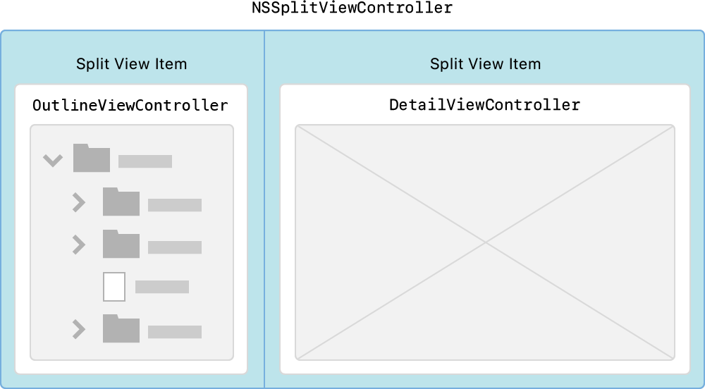
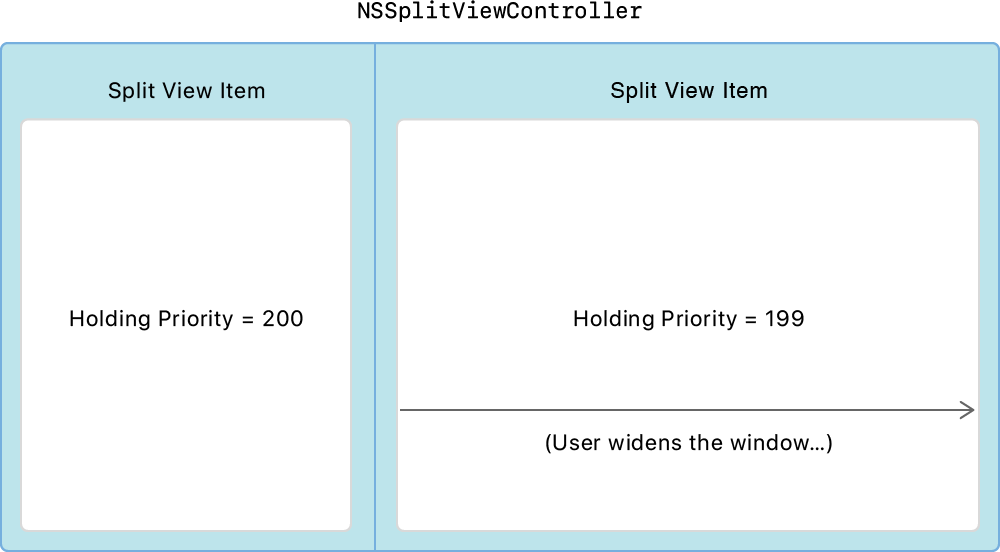

# Navigating Hierarchical Data Using Outline and Split Views

Build a structured user interface that simplifies navigation in your app.

## Overview

Just as a table view organizes a list of objects linearly, an outline view organizes objects hierarchically. When an app's user interface becomes more complex, an outline format can help keep it organized.

This sample shows how to use [`NSOutlineView`](https://developer.apple.com/documentation/appkit/nsoutlineview) to navigate hierarchical data. `NSOutlineView` is a Cocoa view that uses a row-and-column format. Rows are expanded and collapsed to control the amount of information presented.  The outline is a hierarchical list of images, grouped into containers. The hierarchy is predefined in the `DataSource.plist` file.

The outline view uses [`NSTableViewSelectionHighlightStyleSourceList`](https://developer.apple.com/documentation/appkit/nstableviewselectionhighlightstyle/nstableviewselectionhighlightstylesourcelist), for:
* Row-selection indication in a lighter blue than the default color.
* Group nodes that look similar to the Finder's sidebar.
* Blurred background content to add depth to your interface.

It does this by setting the highlight appearance in the storyboard, but you can also configure it in code:

`outlineView.selectionHighlightStyle = .sourceList`

When you use `NSOutlineView` with [`NSSplitViewController`](https://developer.apple.com/documentation/appkit/nssplitviewcontroller), your app presents data in a master-detail format similar to that of the Xcode Project navigator or the Finder.

## Configure the Split-View Controller

An outline view works well as part of a master-detail user interface. When the user selects an item from the outline view on the left, the detail view shows the results of the selection. For a master-detail configuration, use [`NSSplitView`](https://developer.apple.com/documentation/appkit/nssplitview), which arranges two or more views in a linear stack running horizontally. Each view is embedded in its own [`NSSplitViewItem`](https://developer.apple.com/documentation/appkit/nssplitviewitem). In this sample project, the left split-view item is a view controller called `OutlineViewController`, and the right split-view item is called `DetailViewController`. The `OutlineViewController` class focuses on how to use `NSOutlineView`.



In a master-detail user interface, the list view on the left must remain the same size when the split view grows or shrinks, while the detail view on the right changes size. To implement this behavior, the app uses the *holding priority* on the split-view items: The view with the lowest holding priority is the first to take on additional width as the split view grows or shrinks. To keep the left split-view item from growing, set its holding priority to `200`, and set the item on the right side to `199`.



## Define Hierarchical Content with a Tree Controller

The [`NSTreeController`](https://developer.apple.com/documentation/appkit/nstreecontroller) class is the data source for the outline view. It acts as the controller when binding `NSOutlineView` to its hierarchical collection of objects. These objects represent *nodes*, which are implemented by the `Node` class.

This sample uses two kinds of nodes:
* URL based, representing a container or document found on disk.
* Non-URL based, representing a container or document found in memory only.

A node can represent either a container or a document. A container node groups other nodes together. Each container node has its own unique identifier, whereas document nodes have an empty identifier with no children.

``` swift
class Node: NSObject, Codable {
    var type: NodeType = .unknown
    var title: String = ""
    var identifier: String = ""
    var url: URL?
    @objc dynamic var children = [Node]()
}
```
[View in Source](x-source-tag://NodeClass)

The hierarchy consists of nodes read from the `DataSource.plist` file. Node objects adopt the `Decodable` protocol and are automatically created directly from the property list file.

``` swift
guard let newPlistURL = Bundle.main.url(forResource: "DataSource", withExtension: "plist") else {
    fatalError("Failed to resolve URL for `DataSource.plist` in bundle.")
}
do {
    // Populate the outline view with the plist content.
    struct OutlineData: Decodable {
        let children: [Node]
    }
    // Decode the top-level children of the outline.
    let plistDecoder = PropertyListDecoder()
    let data = try Data(contentsOf: newPlistURL)
    let decodedData = try plistDecoder.decode(OutlineData.self, from: data)
    for node in decodedData.children {
        // Recursively add further content from the given node.
        addNode(node)
        if node.type == .container {
            selectParentFromSelection()
        }
    }
} catch {
    fatalError("Failed to load `DataSource.plist` in bundle.")
}
```
[View in Source](x-source-tag://DataSource)

## Handle Drag and Drop

Users drag and drop nodes from within the outline view to rearrange them, or drag nodes representing images out to other apps. Users may also drag in image files from the Finder, Photos, Mail, or Safari. For more information, see [`Drag and Drop`](https://developer.apple.com/documentation/appkit/drag_and_drop). This sample shows how to create promise drags by dragging out a copy of an image file using [`NSFilePromiseProvider`](https://developer.apple.com/documentation/appkit/nsfilepromiseprovider).

## Add a Contextual Menu

The outline view uses contextual menus, or *shortcut menus*, that provide access to frequently used commands. Control-clicking or right-clicking an outline view node opens its contextual menu. The `NSOutlineView` [`menu(for:)`](https://developer.apple.com/documentation/appkit/nsview/1483231-menu) function creates these contextual menus. Override this function with the `NSOutlineView` subclass to return a contextual menu. The contextual menu operations are add, remove, and rename.

## Integrate with the Edit Menu

You can use the Edit menu to directly affect the contents of the outline view. This sample adds a Delete menu item for deleting items from the outline view. `OutlineViewController` implements the `IBAction` delete function, so the user can choose the menu item or press the delete key.

``` swift
// User chose the Delete menu item or pressed the delete key.
@IBAction func delete(_ sender: AnyObject) {
    removeItems()
}
```
[View in Source](x-source-tag://Delete)

You use the [`NSUserInterfaceValidations`](https://developer.apple.com/documentation/appkit/nsuserinterfacevalidations) protocol to enable or disable the Delete menu item based on the selection shown in the outline view.

``` swift
func validateUserInterfaceItem(_ item: NSValidatedUserInterfaceItem) -> Bool {
    if item.action == #selector(delete(_:)) {
        return !treeController.selectedObjects.isEmpty
    }
    return true
}
```
[View in Source](x-source-tag://DeleteValidation)

## Restore the Outline View

This sample saves and restores:
* The outline view's selection.
* The disclosure state of each container node.

You use the window restoration system's [`encodeRestorableState(with:)`](https://developer.apple.com/documentation/appkit/nsresponder/1526236-encoderestorablestate) function to save the outline view's node selection. The next time the app is launched, use [`restoreState(with:)`](https://developer.apple.com/documentation/appkit/nsresponder/1526253-restorestate) to restore that selection.

When the outline view saves the disclosure states, it encodes each container as an archived object by using the `persistentObjectForItem` function.

``` swift
func outlineView(_ outlineView: NSOutlineView, persistentObjectForItem item: Any?) -> Any? {
    let node = OutlineViewController.node(from: item!)
    return node?.identifier // Outgoing object is the identifier.
}
```
[View in Source](x-source-tag://EncodeExpansion)

When the outline view restores the disclosure states, it calls this function for each one, to translate the archived object to an outline view item:

``` swift
func outlineView(_ outlineView: NSOutlineView, itemForPersistentObject object: Any) -> Any? {
    let node = nodeFromIdentifier(anObject: object)  // Incoming object is the identifier.
    return node
}
```
[View in Source](x-source-tag://RestoreExpansion)

